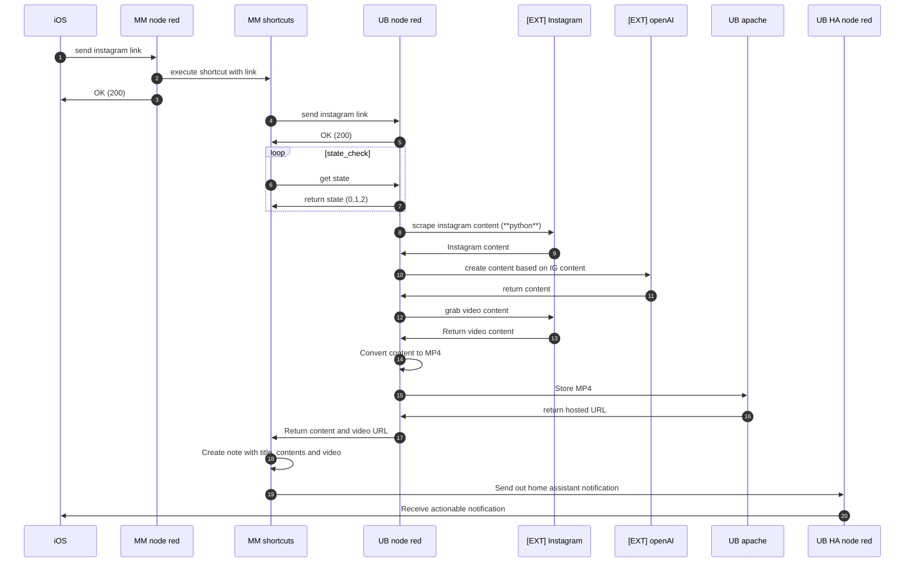

**Problem I wanted to solve**

I'm getting bombarded, but also am searching for a lot of new recipes, home improvement videos etc. that I see on instagram. I store them in a specific template in notes, that also allows it to be searchable, I add ratings, when I last ate it etc.

So what I wanted to achieve is:

* a simple shortcut to share my links to
* that would download the video
* take the text that is the description of the video
* clean up the text (no hashtags etc.)
* translate the text to my language (Dutch)
* for recipes, always have an ingredients list and a recipe

**Solution**

Unfortunately the solution wasn't that easy, but I'll put down the writing blocks (and learnings)

* My phone shortcut only sends the URL to the 'back-end'
* The back-end is node-red, running on my (naked) mac mini. The exec node is my friend. This takes care of parts 1,2,3 and 4 below.
* Run shortcuts using terminal commands using this node-red/exec node. `shortcuts run xxxx -i yyyy` (where -i is input)
* A well known bit of software to grab the videos (1)
* Built a python script to grab the first bits of text on the page (2)
* Send over the text to openAI for formatting. (3)
* Give back the video on web request (4)
* the shortcut will also create the note with all the information on the mac mini. It takes some logic in the 'while' loop to check the state, and repeat until the state of the back-end is 'finished'
* Finally, when it's done, the shortcut will also trigger a notification through 'home assistant', that will tell my phone it's done processing and link to the specific note.

**Learnings**

* Running in docker was a pain, on mac, docker is already not great, on ubuntu it was impossible to run 'shortcuts' as terminal command. So naked mac mini was the best solution
* in theory you could run 'that well known bit of software' to grab videos as well in a-shell, but that would limit my use of my device significantly
* Same goes for the scraping of a site, you could do it in shortcuts with a lot of patience, but it will limit the time spent.
* And also for openAI/chatGPT, it could be run inside the app if needed.
* Home assistant is fine for (actionable) notifications. It could also be pushcut, pushbullet etc. just the 'native' notification isn't shown on all devices.
* Home assistant is super simple to notify on all, or specific devices.

**To do/need help**
* I'd love to open a specific note, but can't find the ID to use for the `mobilenotes://` url handler.
* Right now it's recipes, the future will also handle 'home improvement' or other videos. 

**sequence diagram**

